# Real-World SVG Pipeline Gallery

This gallery records four small real-image cases run through `run_svg_pipeline`
with `mode: "both"`, plus one WEN-426 before/after case for baked RGB
checkerboard transparency. Each case includes the bounded source image, SVG
candidates, rendered diff contact sheets, assessment JSON, and a Chrome-open
screenshot review.

Source metadata is in [`source_metadata.json`](source_metadata.json). A compact
machine-readable summary is in [`gallery_manifest.json`](gallery_manifest.json).

## Browser Review

All generated SVGs were opened from `file://` URLs in Chrome on 2026-06-23.
The WEN-426 screenshots were captured with Google Chrome 149.0.7827.116. The browser screenshots are in
[`browser-review/`](browser-review/), and the combined review sheet is:

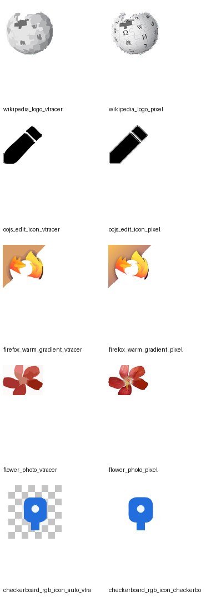

Manual visual conclusions are recorded in
[`browser_review.json`](browser_review.json):

- Wikipedia logo: pixel preserves the globe glyph/detail fidelity; vtracer is
  recognizable but simplified.
- OOjs edit icon: both open correctly; pixel preserves the thin
  highlight/outline while vtracer simplifies to an editable silhouette.
- Firefox warm-gradient tile: both open correctly after `warm-icon` masking;
  pixel preserves gradients more closely, while vtracer keeps the main
  silhouette and color bands.
- Flower photo: pixel preserves the bounded raster source exactly; vtracer is a
  stylized posterized approximation rather than photo-fidelity output.
- Checkerboard RGB icon: default `auto` preserves baked checkerboard fills, while
  `mask_mode: "checkerboard"` removes the 12 px checkerboard background before
  vtracer.

## Cases

### Wikipedia Logo

Mask mode: `alpha`; quality profile: `balanced`.

| Source | vtracer SVG | vtracer diff | pixel SVG | pixel diff |
| --- | --- | --- | --- | --- |
|  | 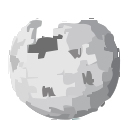 | 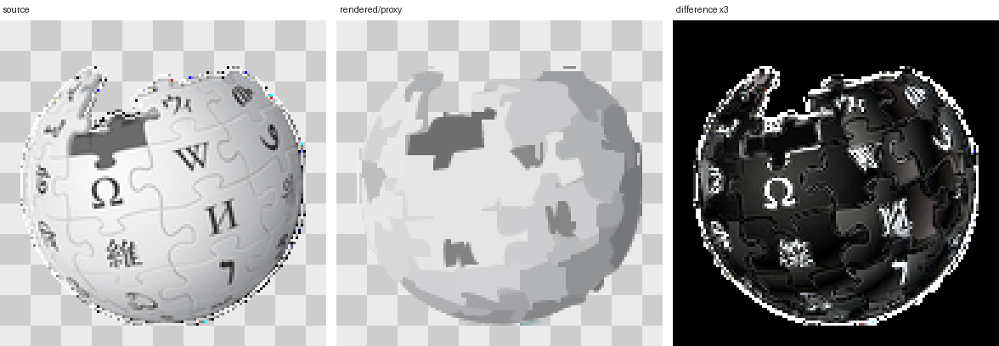 |  | 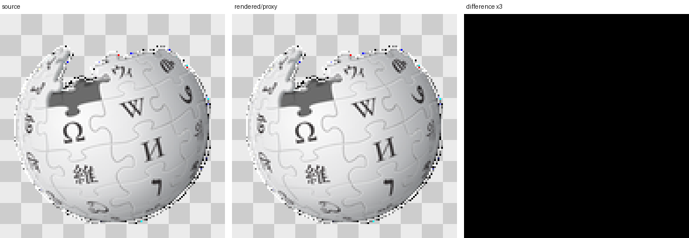 |

| Candidate | Status | alpha_iou | rgba_ssim | mean_abs_rgba_delta | paths | assessment |
| --- | --- | ---: | ---: | ---: | ---: | --- |
| vtracer | warn | 0.9512 | 0.6929 | 12.51 | 112 | [`assessment.json`](wikipedia-logo/vtracer/validation/wikipedia_logo_vtracer_assessment.json) |
| pixel | pass | 1.0000 | 1.0000 | 0.00 | 1740 | [`assessment.json`](wikipedia-logo/pixel/validation/wikipedia_logo_pixel_assessment.json) |

### OOjs Edit Icon

Mask mode: `alpha`; quality profile: `balanced`.

| Source | vtracer SVG | vtracer diff | pixel SVG | pixel diff |
| --- | --- | --- | --- | --- |
|  |  | 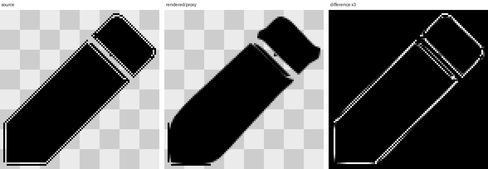 |  | 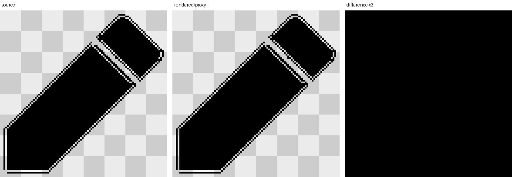 |

| Candidate | Status | alpha_iou | rgba_ssim | mean_abs_rgba_delta | paths | assessment |
| --- | --- | ---: | ---: | ---: | ---: | --- |
| vtracer | fail | 0.8947 | 0.9603 | 2.31 | 167 | [`assessment.json`](oojs-edit-icon/vtracer/validation/oojs_edit_icon_vtracer_assessment.json) |
| pixel | pass | 1.0000 | 1.0000 | 0.00 | 1 | [`assessment.json`](oojs-edit-icon/pixel/validation/oojs_edit_icon_pixel_assessment.json) |

### Firefox Warm Gradient

Mask mode: `warm-icon`; quality profile: `fidelity`.

| Source | vtracer SVG | vtracer diff | pixel SVG | pixel diff |
| --- | --- | --- | --- | --- |
|  |  | 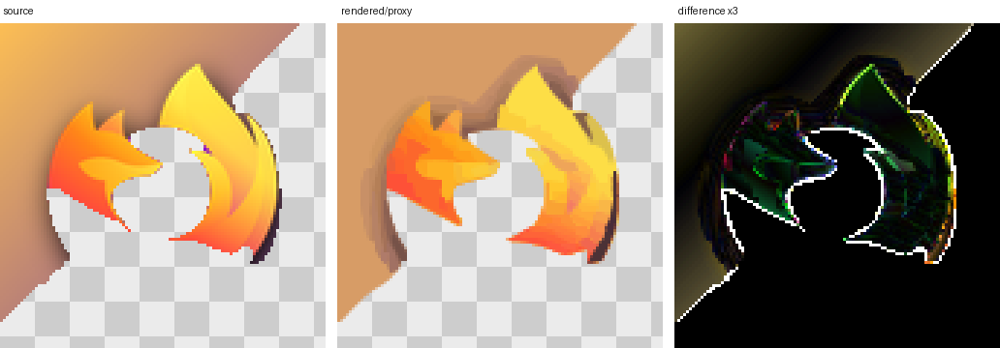 |  | 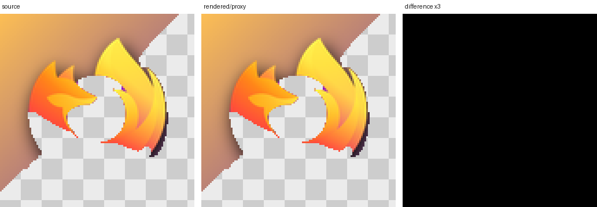 |

| Candidate | Status | alpha_iou | rgba_ssim | mean_abs_rgba_delta | paths | assessment |
| --- | --- | ---: | ---: | ---: | ---: | --- |
| vtracer | warn | 0.9512 | 0.8437 | 7.25 | 102 | [`assessment.json`](firefox-warm-gradient/vtracer/validation/firefox_warm_gradient_vtracer_assessment.json) |
| pixel | pass | 1.0000 | 1.0000 | 0.00 | 2746 | [`assessment.json`](firefox-warm-gradient/pixel/validation/firefox_warm_gradient_pixel_assessment.json) |

### Flower Photo

Mask mode: `none`; quality profile: `compact`.

| Source | vtracer SVG | vtracer diff | pixel SVG | pixel diff |
| --- | --- | --- | --- | --- |
|  |  | 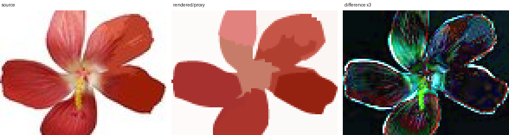 |  |  |

| Candidate | Status | alpha_iou | rgba_ssim | mean_abs_rgba_delta | paths | assessment |
| --- | --- | ---: | ---: | ---: | ---: | --- |
| vtracer | warn | 1.0000 | 0.7469 | 10.95 | 11 | [`assessment.json`](flower-photo/vtracer/validation/flower_photo_vtracer_assessment.json) |
| pixel | pass | 1.0000 | 1.0000 | 0.00 | 4342 | [`assessment.json`](flower-photo/pixel/validation/flower_photo_pixel_assessment.json) |

### Checkerboard RGB Icon

Before/after WEN-426 case for an RGB input with no alpha where fake transparency
is baked as a `#ffffff/#c4c4c4` checkerboard. Default `auto` remains `flood`; the
new strategy is explicit `mask_mode: "checkerboard"`.

| Source | auto vtracer SVG | auto diff | checkerboard vtracer SVG | checkerboard diff |
| --- | --- | --- | --- | --- |
|  |  | 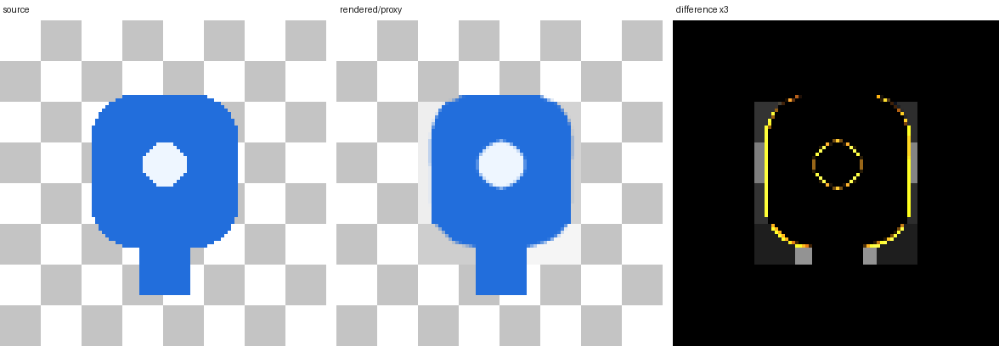 |  | 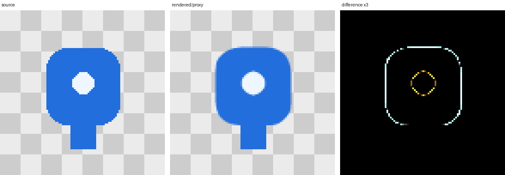 |

| Candidate | Effective mask | checkerboard detected | alpha_iou | rgba_ssim | paths | fills | foreground pixels | assessment |
| --- | --- | --- | ---: | ---: | ---: | ---: | ---: | --- |
| auto before | `flood` | no | 1.0000 | 0.9605 | 54 | 8 | 9216 | [`assessment.json`](checkerboard-rgb-icon/auto/validation/checkerboard_rgb_icon_auto_vtracer_assessment.json) |
| checkerboard after | `checkerboard` | yes, 12 px | 0.9467 | 0.9426 | 2 | 2 | 2009 | [`assessment.json`](checkerboard-rgb-icon/checkerboard/validation/checkerboard_rgb_icon_checkerboard_vtracer_assessment.json) |

Browser screenshot pixel check: the auto SVG screenshot has 3366 `#c4c4c4` gray
checker pixels; the checkerboard SVG screenshot has 0.
